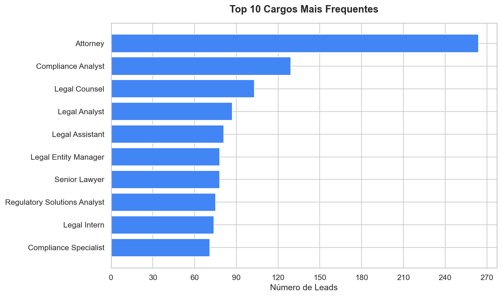
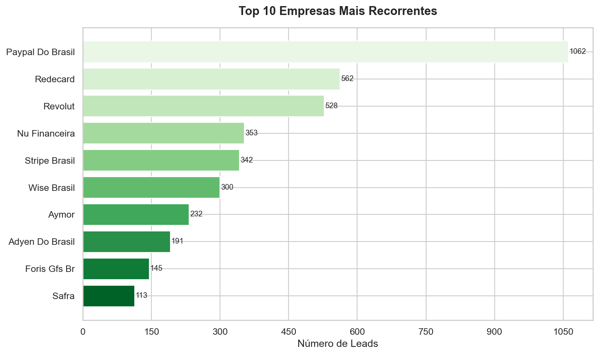
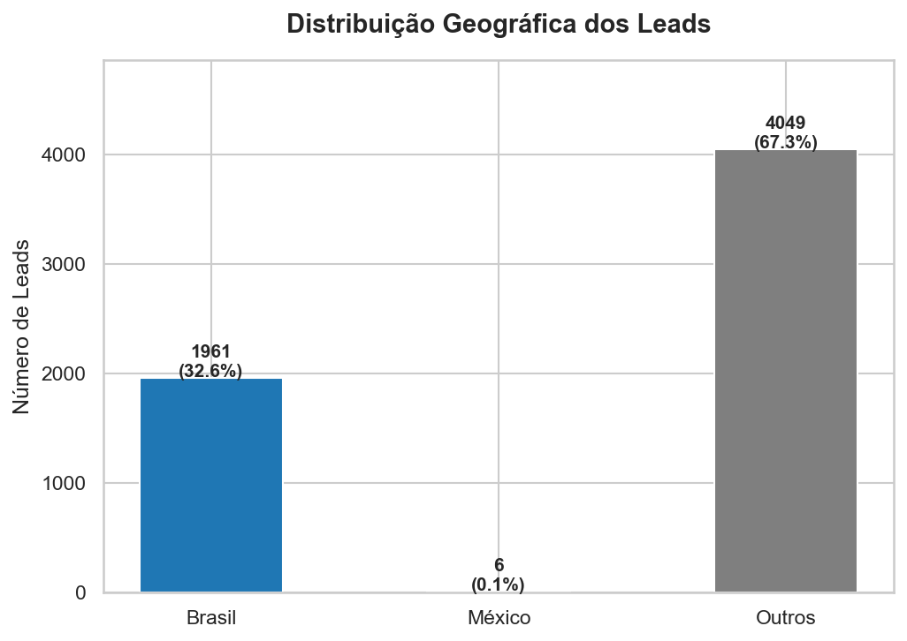
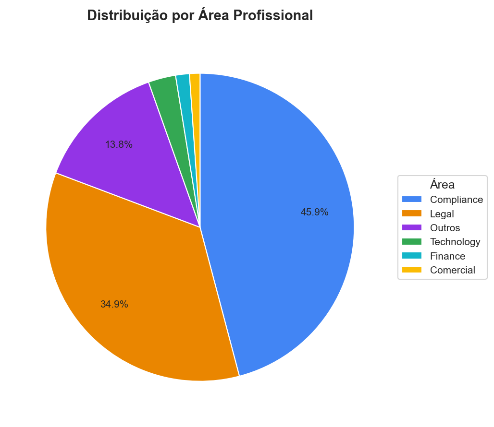

# Projeto 3: Harmonização, Análise e Visualização da Base de Leads

**Aluno:** Gustavo Waltrick  
**Turma:** Turma F — Análise de Dados e TI Aplicado a Gestão — Lisboa  
**Formadores:** Pedro Azeredo Coutinho Stob e Marcelo Ferreira  
**Data de entrega:** Junho de 2026

---

## 1. Sumário Executivo

Este projeto teve como objetivo tratar uma base bruta de 6.016 leads B2B do setor financeiro e de pagamentos, oriunda de campanhas de LinkedIn Ads. A base apresentava problemas significativos de qualidade: 21% dos registos sem e-mail válido, 94% sem informação de país, nomes de empresas com sufixos jurídicos completos em maiúsculas e inconsistências de encoding.

O pipeline de harmonização foi implementado em Python (Pandas), cobrindo as cinco tarefas obrigatórias do enunciado: padronização de e-mails, renomeação de colunas para snake_case, normalização de nomes próprios, harmonização de nomes de empresas e criação de coluna de país padronizado.

A análise revelou que a base é fortemente concentrada nas áreas de Compliance (45,9%) e Legal (34,9%), com domínio claro do Brasil (32,6%) entre os países identificáveis. A empresa com mais representação é o Paypal Do Brasil, com 1.062 leads (17,7% do total).

---

## 2. Contexto e Objetivos

### 2.1. Contexto

A base de dados analisada (`leads_bruto.xlsx`) provém de campanhas de LinkedIn Ads e contém registos de contactos B2B do setor de pagamentos e serviços financeiros. Os dados foram fornecidos no âmbito do Projeto Final do curso Análise de Dados e TI Aplicado à Gestão da Prepara Portugal.

### 2.2. Objetivos

1. Importar e inspecionar a base bruta, documentando os problemas de qualidade encontrados.
2. Harmonizar e padronizar os dados em cinco dimensões obrigatórias.
3. Realizar análise exploratória respondendo às cinco perguntas de negócio definidas no enunciado.
4. Gerar quatro visualizações obrigatórias que apoiem a leitura dos dados.
5. Produzir este documento final como registo de todo o processo.

---

## 3. Apresentação da Base Original

### 3.1. Estrutura

A base original contém **6.016 registos** e **7 colunas**:

| Coluna original | Tipo | Descrição |
|-----------------|------|-----------|
| `email` | str | Endereço de e-mail do lead |
| `firstname` | str | Primeiro nome |
| `lastname` | str | Apelido |
| `jobtitle` | str | Cargo / função |
| `employeecompany` | str | Empresa (nome jurídico ou abreviado) |
| `country` | str | País |
| `googleaid` | float | ID Google (100% nulo) |

### 3.2. Diagnóstico Inicial de Qualidade

| Coluna | Nulos | % | Observações |
|--------|-------|---|-------------|
| `email` | 1.262 | 21,0% | Sem e-mail ou formato inválido |
| `firstname` | 0 | 0% | Sem nulos |
| `lastname` | 11 | 0,2% | Alguns valores com apenas uma letra inicial |
| `jobtitle` | 168 | 2,8% | Mistura de inglês e português |
| `employeecompany` | 69 | 1,1% | Nomes jurídicos completos em maiúsculas; encoding corrompido (`CR…DITO`) |
| `country` | 5.663 | 94,1% | Quase totalmente vazio |
| `googleaid` | 6.016 | 100% | Coluna inutilizável, removida |

---

## 4. Metodologia

### 4.1. Ferramentas Escolhidas e Justificativa

O projeto foi implementado em **Python 3.13**, com o seguinte conjunto de bibliotecas:

| Biblioteca | Versão | Finalidade |
|------------|--------|------------|
| Pandas | 3.0.3 | Manipulação e análise de dados |
| Matplotlib | 3.10.9 | Geração de gráficos estáticos |
| Seaborn | 0.13.2 | Estilo e paletas de visualização |
| OpenPyXL | 3.1.5 | Leitura e escrita de ficheiros Excel |
| email-validator | 2.3.0 | Validação de formato e sintaxe de e-mails |
| Unidecode | 1.4.0 | Normalização de caracteres especiais |

A escolha do Python deve-se à sua flexibilidade para tratamento de dados textuais heterogéneos e à possibilidade de automatizar todo o pipeline de forma reprodutível. O Claude (Anthropic) foi utilizado como ferramenta de assistência à codificação, à semelhança de ferramentas como o GitHub Copilot — as decisões metodológicas, a estrutura do pipeline e os critérios de harmonização foram definidos com base nos conhecimentos adquiridos ao longo do curso.

### 4.2. Pipeline de Trabalho

O projeto foi organizado em três scripts sequenciais:

```
data/raw/leads_bruto.xlsx
        │
        ▼
scripts/01_harmonizacao.py  →  data/processed/leads_harmonizados.xlsx
        │
        ▼
scripts/02_analise.py       →  outputs/analise_resultados.txt
        │
        ▼
scripts/03_visualizacoes.py →  outputs/graficos/*.png
```

---

## 5. Harmonização da Base

### 5.1. Padronização da Coluna de E-mail

- Conversão para minúsculas e remoção de espaços em branco (`str.lower().str.strip()`).
- Validação de formato com `email-validator` (verificação de sintaxe sem chamada DNS).
- Criação da coluna booleana `email_valido`.
- Identificação de e-mails duplicados com `duplicated(keep=False)`, criando a coluna `email_duplicado`.

**Resultado:** 4.754 e-mails válidos | 1.262 inválidos ou nulos | 123 duplicados identificados.

### 5.2. Padronização dos Nomes das Colunas

Todas as colunas foram renomeadas para **snake_case sem acentos**, eliminando ambiguidades e garantindo compatibilidade com sistemas CRM e BI:

| Nome original | Nome padronizado |
|---------------|-----------------|
| `firstname` | `primeiro_nome` |
| `lastname` | `sobrenome` |
| `jobtitle` | `cargo` |
| `employeecompany` | `empresa` |
| `country` | `pais` |
| `googleaid` | *(removida — 100% nula)* |

### 5.3. Padronização de Nomes Próprios

- `primeiro_nome` e `sobrenome`: remoção de espaços extra e aplicação de Title Case (`str.title()`).
- Criação da coluna `nome_completo` (concatenação de `primeiro_nome` + `sobrenome`).
- Apelidos nulos preenchidos com string vazia antes da concatenação.

### 5.4. Harmonização de Nomes das Empresas

Os nomes originais estavam em maiúsculas e incluíam sufixos jurídicos extensos (ex.: `PAYPAL DO BRASIL INSTITUIÇÃO DE PAGAMENTO LTDA.`). O processo aplicado:

1. Remoção de sufixos jurídicos via expressão regular (LTDA, S.A., INSTITUIÇÃO DE PAGAMENTO, SOCIEDADE DE CRÉDITO DIRETO, etc.).
2. Conversão para Title Case.
3. Remoção do caracter de encoding corrompido (`…`).
4. Resultado guardado na coluna `empresa_harmonizada`.

**Exemplo:** `PAYPAL DO BRASIL INSTITUIÇÃO DE PAGAMENTO LTDA.` → `Paypal Do Brasil`

### 5.5. Coluna País Padronizado

A coluna `pais` original tinha 94,1% de valores nulos. A estratégia adotada foi inferir o país pelo domínio do e-mail, agrupando em três categorias conforme o enunciado:

| Regra | País atribuído |
|-------|---------------|
| Domínio `.br` ou `.com.br` | Brasil |
| Domínio `.mx` | México |
| País original = "Brazil" | Brasil |
| País original = "Mexico" | México |
| Qualquer outro caso | Outros |

Resultado guardado na coluna `pais_padronizado`.

---

## 6. Análise Exploratória

### 6.1. Quantidade de E-mails Inválidos

Do total de 6.016 registos:
- **1.262 e-mails inválidos ou nulos** — correspondem a **21,0%** da base.
- **123 registos marcados como duplicados** — correspondem a **59 endereços de e-mail únicos** que aparecem mais de uma vez na base. O método `duplicated(keep=False)` marca todas as ocorrências de um e-mail repetido, não apenas as cópias excedentes. Numa operação de limpeza, seriam removidos 64 registos excedentes, ficando apenas um por e-mail.

Esta dimensão de dados inválidos é relevante para qualquer ação de CRM, pois cerca de 1 em cada 5 leads não pode ser contactado por e-mail.

### 6.2. Os 5 Cargos Mais Frequentes

| # | Cargo | Nº de Leads |
|---|-------|------------|
| 1 | Attorney | 264 |
| 2 | Compliance Analyst | 129 |
| 3 | Legal Counsel | 103 |
| 4 | Legal Analyst | 87 |
| 5 | Legal Assistant | 81 |

Os cinco cargos mais frequentes pertencem todos às áreas jurídica e de compliance, o que revela o perfil da base: profissionais de regulação e conformidade do setor financeiro.

### 6.3. Quantidade de Empresas Únicas

Após harmonização dos nomes (remoção de sufixos jurídicos e normalização): **377 valores únicos**, incluindo a categoria `Desconhecido` (69 registos sem empresa preenchida na base original). Excluindo `Desconhecido`, a base contém **376 empresas reais distintas**.

### 6.4. Empresa Mais Recorrente

**Paypal Do Brasil** — com **1.062 leads**, representando 17,7% de toda a base. A forte concentração numa única empresa sugere que esta base foi recolhida com foco em instituições de pagamento de grande dimensão.

### 6.5. Leads por País

| País | Leads | % |
|------|-------|---|
| Outros | 4.049 | 67,3% |
| Brasil | 1.961 | 32,6% |
| México | 6 | 0,1% |

O Brasil é o único país com expressão significativa entre os identificáveis. A categoria "Outros" inclui registos cujo país não foi possível inferir pelo domínio do e-mail (domínios genéricos como `.com`, `.io`, `.co`).

---

## 7. Visualizações

### 7.1. Gráfico 1 — Top 10 Cargos Mais Frequentes



Gráfico de barras horizontais com os 10 cargos mais frequentes. Confirma a predominância de perfis jurídicos (Attorney, Legal Counsel, Legal Analyst) e de compliance.

### 7.2. Gráfico 2 — Top 10 Empresas Mais Recorrentes



Gráfico de barras horizontais com as 10 empresas com mais leads. O Paypal Do Brasil destaca-se claramente com mais do dobro da segunda empresa (Redecard, com 562 leads).

### 7.3. Gráfico 3 — Distribuição Geográfica (Brasil / México / Outros)



Gráfico de barras com as três categorias geográficas definidas no enunciado. O Brasil representa 32,6% da base; México tem presença residual (0,1%); a grande maioria (67,3%) não tem país identificável.

### 7.4. Gráfico 4 — Distribuição por Área Profissional



Gráfico de pizza com agrupamento dos cargos em cinco grandes áreas profissionais, classificadas por palavras-chave. Compliance (45,9%) e Legal (34,9%) representam juntas 80,8% da base.

---

## 8. Dashboard Interativo — Looker Studio

Como complemento às visualizações estáticas geradas pelo script Python, foi desenvolvido um dashboard interativo no **Google Looker Studio**, conectado à base harmonizada exportada em CSV.

O dashboard replica os 4 gráficos obrigatórios em formato interativo, com filtros cruzados e atualização dinâmica dos dados. A construção do dashboard serviu também como **validação independente** dos resultados do pipeline Python: ao comparar os valores gerados pelo script com os valores calculados pelo Looker Studio a partir do mesmo ficheiro CSV, foi possível confirmar a consistência dos dados e detetar dois erros que estavam na implementação original (ver Secção 11).

**Link do dashboard:** https://datastudio.google.com/s/knZFQiJOqAE

---

## 9. Conclusões

A base analisada é uma base de leads B2B altamente especializada no setor de pagamentos e serviços financeiros, com foco claro em profissionais de áreas regulatórias — Compliance e Legal representam 80,8% dos registos classificáveis.

**Principais conclusões para uso em CRM e BI:**

1. **Qualidade dos e-mails é o maior problema operacional.** Com 21% de e-mails inválidos, qualquer campanha de e-mail marketing terá uma taxa de entrega máxima teórica de 79%. Recomenda-se enriquecer a base com e-mails válidos antes de qualquer ação.

2. **Concentração geográfica no Brasil.** Dos leads com país identificável, 99,7% são do Brasil. A base não é adequada para campanhas direcionadas a outros mercados sem enriquecimento.

3. **Alta concentração em poucas empresas.** O Paypal Do Brasil representa sozinho 17,7% da base. Isso pode indicar uma campanha de LinkedIn Ads muito direcionada para essa empresa ou um viés de recolha de dados.

4. **Perfil do decisor:** os cargos mais frequentes (Attorney, Compliance Analyst, Legal Counsel) indicam que a base é adequada para produtos e serviços de compliance, RegTech, soluções jurídicas para o setor financeiro ou formação especializada.

5. **País como campo não fiável.** A inferência por domínio de e-mail, embora útil, não substitui a recolha direta desta informação. Futuras campanhas devem incluir o campo país como obrigatório.

---

## 10. Limitações do Estudo

- A inferência de país por domínio de e-mail é uma aproximação: domínios genéricos (`.com`, `.io`) não permitem identificar o país real do lead.
- Os nomes de empresas com encoding corrompido (`CR…DITO`) não puderam ser reconstituídos automaticamente sem a fonte original.
- A coluna `googleaid` estava 100% vazia, impossibilitando análise por esse identificador.
- A classificação de cargos por área (Legal, Compliance, Finance, etc.) foi feita por regras de palavras-chave — pode haver erros de classificação em cargos atípicos.

---

## 11. Registo de Erros Detetados e Corrigidos

Durante o desenvolvimento do projeto, após validação cruzada entre o pipeline Python e o dashboard Looker Studio, foram identificados e corrigidos dois erros:

### Erro 1 — Nome "Nu Financeira ." com ponto final residual

**Onde:** `scripts/01_harmonizacao.py`, função `clean_company_name()`

**Problema:** A expressão regular `\bS\.A\.?\b` utilizada para remover sufixos jurídicos apresentava um comportamento inesperado com word boundaries. Quando aplicada a nomes terminados em "S.A." no fim da string, o regex correspondia apenas a "S.A" (3 caracteres), deixando o ponto final "." isolado no nome da empresa. A limpeza subsequente `re.sub(r"[,.\-]+\s*$", ...)` não removia o espaço antes do ponto ("Nu Financeira ."), resultando em nomes com ponto residual no ficheiro de saída.

**Por que aconteceu:** O quantificador `\.?` torna o último ponto opcional, mas o `\b` após o grupo exige uma word boundary. Após "." (não-palavra) no fim de string, não existe boundary → o regex preferia a correspondência mais curta "S.A" (com boundary após "A"), deixando "." por tratar. O regex de limpeza seguinte `[,.\-]+\s*$` não capturava o padrão " ." (espaço antes do ponto).

**Correção aplicada:** Alterada a expressão de limpeza de `r"[,.\-]+\s*$"` para `r"[\s,.\-/]+$"`, que passa a capturar também espaços antes de pontuação terminal — eliminando o padrão " ." e qualquer combinação de espaços e pontuação no fim do nome.

**Impacto:** O nome "Nu Financeira ." (353 leads) passou a ser corretamente harmonizado como "Nu Financeira". A contagem de empresas únicas não foi afetada.

---

### Erro 2 — Diferença de percentagens no gráfico de Áreas Profissionais (Looker vs Python)

**Onde:** Campo calculado `area_profissional` no Looker Studio

**Problema:** Após importar o CSV para o Looker Studio e criar o gráfico de pizza, os valores apresentavam diferenças em relação ao script Python: Legal aparecia com 33.7% (em vez de 34.9%) e Outros com 15% (em vez de 13.8%).

**Por que aconteceu:** Duas keywords presentes no script Python estavam ausentes da fórmula CASE criada no Looker Studio:
1. Keyword `"law"` na categoria Legal — títulos como "Law Partner" ou "Corporate Law" eram classificados como "Outros" no Looker por não conterem "lawyer", "attorney" ou "legal".
2. Keyword `"it "` (com espaço) na categoria Technology — 24 registos com títulos "IT Governance Analyst", "Senior IT Governance", etc., eram classificados como "Outros" por não conterem "tech", "engineer" ou "developer".

**Correção aplicada:** Fórmula CASE atualizada no Looker Studio com adição de `|law` no padrão Legal e `|it ` (com espaço) no padrão Technology. Após a correção, todos os valores Looker coincidem com os valores Python ao centésimo: Compliance 45.9%, Legal 34.9%, Outros 13.8%, Technology 2.9%, Finance 1.4%, Comercial 1.1%.

---

## 12. Anexos

### 12.1. Repositório

- **GitHub:** https://github.com/waltrickme/projeto3-prepara-portugal

### 12.2. Stack e Dependências

Ver ficheiro `requirements.txt` no repositório.

### 12.3. Glossário Técnico

| Termo | Definição |
|-------|-----------|
| Lead | Contacto comercial potencial |
| Harmonização | Processo de padronização e limpeza de dados |
| Snake_case | Convenção de nomenclatura: palavras em minúsculas separadas por `_` |
| CRM | Customer Relationship Management — gestão de relações com clientes |
| BI | Business Intelligence — análise de dados para suporte à decisão |
| RegTech | Regulatory Technology — tecnologia aplicada à conformidade regulatória |
| Pipeline | Sequência automatizada de etapas de processamento de dados |
